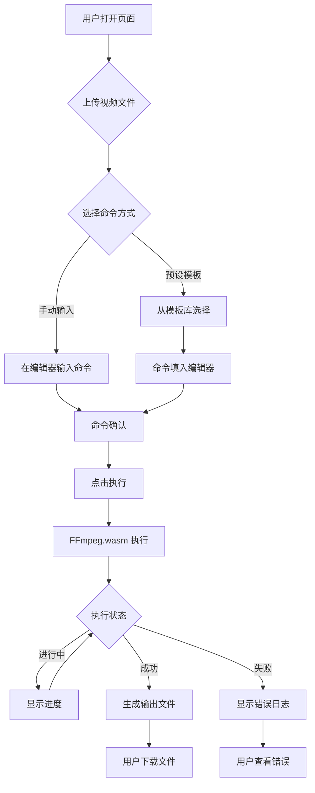

## 1. 产品概述

FFmpeg 命令执行器是一个基于浏览器的视频处理工具，利用 FFmpeg.wasm 在 Web 浏览器中执行 FFmpeg 命令，无需安装本地软件即可完成视频转换、剪辑、滤镜处理等操作。

- 目标用户：视频创作者、开发者、需要快速处理视频的普通用户
- 核心价值：零安装、跨平台、在浏览器中直接执行 FFmpeg 命令

## 2. 核心功能

### 2.1 功能模块

1. **首页/执行页面**: 命令输入区、文件上传区、执行日志、输出下载
2. **预设模板库**: 常用 FFmpeg 命令模板（视频转换、提取音频、压缩等）
3. **历史记录**: 保存最近执行的命令（本地存储）

### 2.2 页面详情

| 页面名称 | 模块名称 | 功能描述 |
|----------|----------|----------|
| 执行页面 | 文件上传 | 支持拖拽上传视频文件到浏览器虚拟文件系统 |
| 执行页面 | 命令编辑器 | 输入/编辑 FFmpeg 命令，支持参数补全 |
| 执行页面 | 执行控制 | 执行按钮、进度显示、取消执行 |
| 执行页面 | 日志输出 | 实时显示 FFmpeg 执行日志 |
| 执行页面 | 输出下载 | 预览和下载处理后的文件 |
| 执行页面 | 预设模板 | 常用命令快速选择和填入 |
| 执行页面 | 历史记录 | 本地保存最近执行的命令 |

## 3. 核心流程

用户打开页面 → 上传视频文件 → 选择预设模板或手动输入命令 → 点击执行 → 查看进度和日志 → 下载输出文件

## 4. 用户界面设计

### 4.1 设计风格

- **主色调**: 深色科技风，采用深蓝/青色为主色调
- **强调色**: 霓虹绿色 (#00FF88) 用于执行按钮和成功状态
- **警告/错误**: 橙红色系
- **按钮风格**: 圆角矩形，带光泽效果
- **字体**: JetBrains Mono 等宽字体用于代码/命令区，Inter 用于正文
- **布局**: 三栏式布局 - 左侧文件/模板，中间命令编辑器，右侧日志/输出
- **背景**: 深色渐变 + 网格纹理

### 4.2 页面设计概览

| 页面名称 | 模块名称 | UI元素 |
|----------|----------|--------|
| 执行页面 | 左侧面板 | 文件上传区 + 预设模板列表 |
| 执行页面 | 中间面板 | 命令编辑器（代码风格）+ 执行按钮 + 参数快捷按钮 |
| 执行页面 | 右侧面板 | 进度条 + 日志终端 + 输出文件预览下载 |
| 执行页面 | 顶部导航 | Logo + 历史记录按钮 + 主题切换 |

### 4.3 响应式设计

- 桌面优先设计
- 平板（>=768px）: 双栏布局
- 移动端（<768px）: 单栏堆叠布局

### 4.4 动画效果

- 页面加载：元素依次淡入
- 执行状态：进度条平滑动画
- 悬停效果：按钮发光、卡片浮起
- 日志输出：打字机效果
